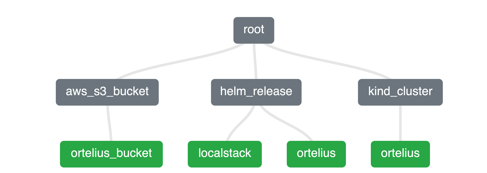
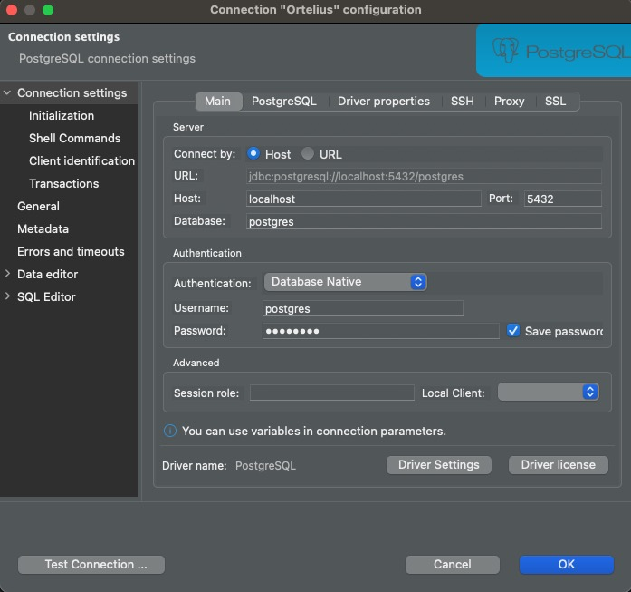
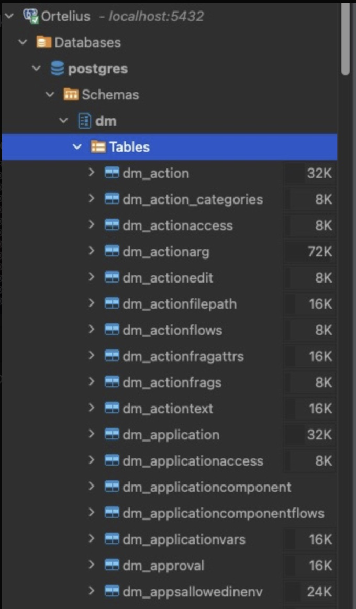
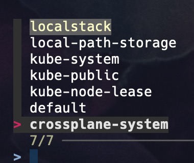
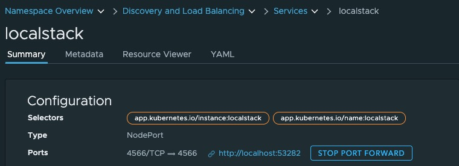
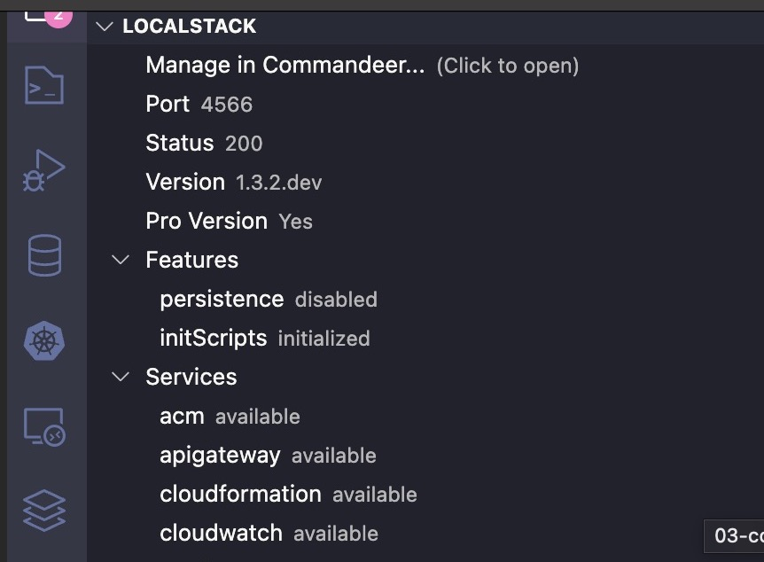
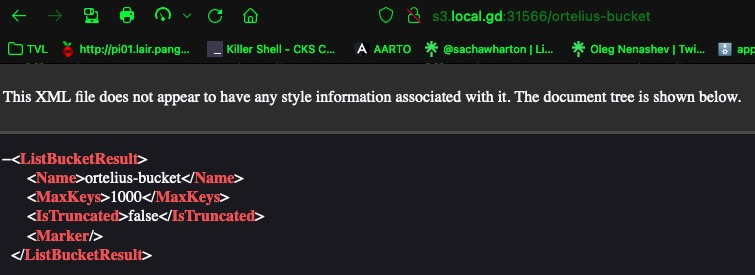
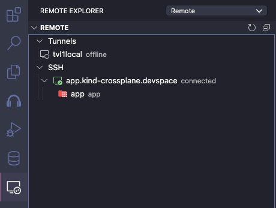
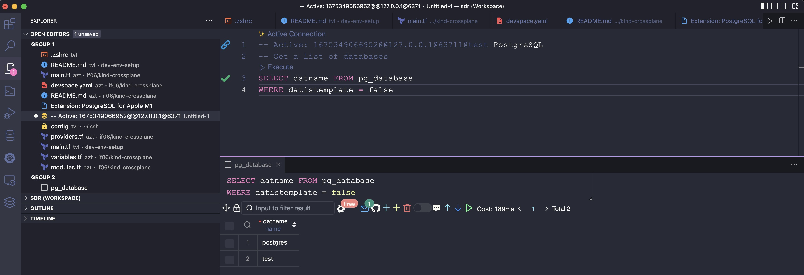

# [Ortelius](https://ortelius.io/) & [Localstack](https://docs.localstack.cloud/overview/) Local Deployment
- [Ortelius \& Localstack Local Deployment](#ortelius--localstack-local-deployment)
- [Project Description](#project-description)
  - [Tools of the trade](#tools-of-the-trade)
  - [Ortelius](#ortelius)
      - [Terraform Structure](#terraform-structure)
  - [Ortelius](#ortelius-1)
    - [How to access Ortelius](#how-to-access-ortelius)
    - [How to access PostgreSQL](#how-to-access-postgresql)
      - [DBeaver](#dbeaver)
      - [Connection settings](#connection-settings)
    - [Kind Ortelius Cluster Details](#kind-ortelius-cluster-details)
      - [Context `kind-ortelius`](#context-kind-ortelius)
      - [Namespaces `ortelius` `localstack`](#namespaces-ortelius-localstack)
      - [Nodes](#nodes)
  - [Docker.com](#dockercom)
    - [GitHub Docker](#github-docker)
  - [Terraform](#terraform)
    - [GitHub Terraform](#github-terraform)
      - [Terraform README](#terraform-readme)
      - [Lets get going](#lets-get-going)
      - [Time the deployment](#time-the-deployment)
      - [Don't time the deployment](#dont-time-the-deployment)
      - [Destroy the deployment](#destroy-the-deployment)
      - [Logs](#logs)
  - [KinD](#kind)
    - [GitHub KinD](#github-kind)
    - [Why KinD?](#why-kind)
      - [Get Nodes](#get-nodes)
      - [Kubeconfig](#kubeconfig)
      - [Get Clusters](#get-clusters)
      - [Logs | Great for debugging \& troubleshooting](#logs--great-for-debugging--troubleshooting)
  - [Container Runtime Interface (CRI) CLI](#container-runtime-interface-cri-cli)
    - [GitHub Crictl](#github-crictl)
      - [List containers and check the container is in a created state](#list-containers-and-check-the-container-is-in-a-created-state)
      - [Start container](#start-container)
      - [Exec a command in a container](#exec-a-command-in-a-container)
  - [Kubernetes.io](#kubernetesio)
    - [GitHub Kubernetes](#github-kubernetes)
      - [Kubectl](#kubectl)
      - [Combine Kubens \& Kubectx with Fuzzy Finder](#combine-kubens--kubectx-with-fuzzy-finder)
      - [FzF](#fzf)
      - [FzF in action](#fzf-in-action)
      - [Kubectx for switching context](#kubectx-for-switching-context)
      - [Kubens for switching namespaces](#kubens-for-switching-namespaces)
  - [Octant](#octant)
    - [GitHub Octant](#github-octant)
      - [Notable Plugins](#notable-plugins)
      - [Octant Port Forward to an Endpoint](#octant-port-forward-to-an-endpoint)
  - [local.gd | DNS @127.0.0.1](#localgd--dns-127001)
  - [Localstack](#localstack)
    - [GitHub LocalStack](#github-localstack)
      - [LocalStack VS Code Extension](#localstack-vs-code-extension)
      - [LocalStack Docs](#localstack-docs)
      - [LocalStack Container](#localstack-container)
      - [LocalStack S3 Endpoint](#localstack-s3-endpoint)
      - [AWS CLI Local](#aws-cli-local)
      - [Configurations](#configurations)
      - [AWS Copilot](#aws-copilot)
  - [DevSpace](#devspace)
    - [GitHub DevSpace](#github-devspace)
      - [Note: Additional tools required for the container](#note-additional-tools-required-for-the-container)
      - [How](#how)
    - [Connect VS Code](#connect-vs-code)
      - [VS Code Extensions](#vs-code-extensions)
    - [Component Helm Chart](#component-helm-chart)
      - [Why?](#why)

# Project Description

The goal is to open up the Microservices world and give visiblity to developers so that it does not feel like you are developing with a blind fold on. The entire package includes Kind (k8s), Docker (sudo K8s nodes stored in a container), Helm Charts (K8s templating)and Terraform (IaC).

DBeaver or any suitable database client for Postgresql can be used to access the Postgresql database. The Postgres database is persisted using volume mounts.

Devspace is the tool for deploying and connecting VS Code to the Dev Container inside the Ortelius namespace. The Dev Container will contain all the tools required for development of that technology stack.

Kubeshark can be used by the developer for Microservice API troubleshooting.

As a final step to your development freedom you can add the LocalStack extension in your Docker Desktop and develop against AWS services running locally on your machine.

The great thing is this is all immutable and transportable to any operating system that supports Docker, Kubectl, Helm, Kind and Terraform.

## Tools of the trade
- [Ortelius](https://ortelius.io)
- [Docker](https://www.docker.com/products/docker-desktop/)
- [Kind](https://kind.sigs.k8s.io/)
- [Helm](https://helm.sh/)
- [Kubectl](https://kubernetes.io/docs/tasks/tools/)
- [Terraform](https://www.terraform.io/intro)
- [Kubeshark](https://kubeshark.co/)
- [Localstack](https://localstack.cloud/)
- [VS Code](https://code.visualstudio.com/)
- [DevSpace](https://www.devspace.sh/)

## [Ortelius](https://ortelius.io/)

Ortelius is central catalog of supply chain and DevOps intelligence. It is designed to track and version composition details for every component of your software supply chain along with all consuming logical applications. With Ortelius, you can easily view your logical application's SBOMs, CVEs, service dependencies, and inventory based on versions, even in a decoupled microservices architecture.

Ortelius aggregates DevOps, security and supply chain data for each independent component moving through the pipeline. It is particularly useful in cloud-native, microservices architectures where the logical application becomes ambiguous. Ortelius tracks who is consuming shared components, versions them when they are updated and then creates new release candidates for every logical applicatio that is impacted by a component change. It then aggregates that data to the logical application level so you don't have to.

The latest version of Ortelius is maintained by the Ortelius Community managed by the [Continuous Delivery Foundation](https://cd.foundation/) (Linux Foundation). It was originally created by [DeployHub](https://www.deployhub.com/) and [OpenMake Software](https://www.openmakesoftware.com/). Our mission is to simplify the adoption of modern architecture through a world-class microservice catalog driven by a supportive and diverse global open source community.

#### Terraform Structure




## [Ortelius](https://ortelius.io/)
- Helm Charts are [here](https://github.com/ortelius/ortelius-charts)
- Chart.yaml is [here](https://github.com/ortelius/ortelius-charts/blob/master/Chart.yaml)
### How to access Ortelius
- Use can access Ortelius at http://localhost:8080/dmadminweb/Home#dhmain
- Ortelius HTTP Kind extra port mappings to a NodePort
```
      # ortelius http port
      extra_port_mappings {
        container_port = 30000
        host_port      = 8080
        listen_address = "0.0.0.0"
      }
```
### How to access PostgreSQL
- PostgreSQL Kind extra port mappings to a NodePort
```
      # postgresql port
      extra_port_mappings {
        container_port = 31432
        host_port      = 5432
        listen_address = "0.0.0.0"
      }
```
#### DBeaver
- Free multi-platform database tool for developers, database administrators, analysts and all people who need to work with databases.
- Supports all popular databases: `MySQL, PostgreSQL, SQLite, Oracle, DB2, SQL Server, Sybase, MS Access, Teradata, Firebird, Apache Hive, Phoenix, Presto, etc`.
- You can use DBeaver Community Edition which is available [here](https://dbeaver.io/)
- Supports ChatGPT integration for smart completion and code generation as an optional extension
- [Apache License 2.0](https://dbeaver.io/product/dbeaver_license.txt)

#### Connection settings
- Password
```
postgres
```

- Ortelius Database Tables



### Kind Ortelius Cluster Details
#### Context `kind-ortelius`
- List all the contexts
```
kubectl config get context
```
- Switch to the kind-ortelius context
```
kubectl config use-context kind-ortelius
```
- Help with contexts
```
kubectl config -h
```
#### Namespaces `ortelius` `localstack`
- List all namespaces
```
kubectl get namespace -A
```
#### Nodes
- Control Plane `ortelius-control-plane`
- Worker `ortelius-worker`
```
kubectl get nodes -A
```

## [Docker.com](https://www.docker.com/)
### [GitHub Docker](https://github.com/docker)

Docker is a platform for developing, shipping, and running applications. It uses containers, which are lightweight, standalone, executable packages of software that include everything needed to run the application, including the code, runtime, libraries, environment variables, and system tools. Containers provide a consistent, isolated environment for applications to run, making it easier to develop, test, and deploy applications. Docker allows developers to automate the deployment of applications into containers and manage containers as a single unit. It simplifies the process of deploying applications, making it easier to scale applications, and enabling organizations to adopt a microservices architecture.

- [Account setup](https://hub.docker.com/signup)
- [Install](https://docs.docker.com/get-docker/)
- Get familiar with the basic commands
- Use [Devdocs](https://devdocs.io/) and the Docker documentation [here](https://docs.docker.com/)
- [Terms & Conditions](https://www.docker.com/legal/docker-terms-service/)

## [Terraform](https://www.terraform.io/intro)
### [GitHub Terraform](https://github.com/hashicorp/terraform)

Terraform is an open-source tool for provisioning and managing infrastructure as code. It provides a simple, declarative syntax for defining infrastructure resources, such as virtual machines, DNS entries, and databases. Terraform can manage popular service providers as well as custom in-house solutions. By describing infrastructure as code, Terraform enables versioning, testing, and collaboration of infrastructure changes. Terraform can create, update, and delete resources in parallel, while minimizing the risk of conflicts and errors. Terraform also provides a state management system that tracks changes to infrastructure over time, making it easier to roll back changes if necessary. With Terraform, organizations can automate their infrastructure management processes, improve reliability, and increase efficiency.

#### [Terraform README](TF-README.md)
- Install Terraform [here](https://www.terraform.io/downloads)
- Documentation is [here](https://www.terraform.io/docs)
- [Terms & Conditions](https://registry.terraform.io/terms)

#### Lets get going
- Clone the repo
- Navigate to `/`
- Run the following
```
terraform init
```
```
terraform plan
```
#### Time the deployment
```
time terraform apply --auto-approve
```
#### Don't time the deployment
```
terraform apply --auto-approve
```
#### Destroy the deployment
```
terraform destroy --auto-approve
```
#### Logs

In total, there 5 log levels which can be used for debugging purposes:

- `TRACE` one of the most descriptive log levels, if you set the log level to *TRACE,* Terraform will write every action and step into the log file.
- `DEBUG` a little bit more sophisticated logging which is used by developers at critical or more complex pieces of code to reduce debugging time.
- `INFO` the info log level is useful when needing to log some informative instructions or readme type instructions.
- `WARN` used when something is not critical but would be nice to include in the form of a log so that the developer can make adjustments later.
- `ERROR` as the name suggests, this is used if something is terribly wrong and is a blocker.
```
export TF_LOG="DEBUG"
```
```
export TF_LOG_PATH="/abraham/terraform-debug.log"
```

## [KinD](https://kind.sigs.k8s.io/)
### [GitHub KinD](https://github.com/kubernetes-sigs/kind)

Kind (Kubernetes in Docker) is a tool for running local Kubernetes clusters using Docker containers as nodes. It provides an easy-to-use environment for testing and developing applications that run on a Kubernetes cluster. Kind allows developers to run a full Kubernetes cluster on their development machine, eliminating the need for remote clusters and making it easier to test and debug applications. Kind creates a multi-node cluster by launching multiple Docker containers on a single host, making it possible to test complex scenarios and network configurations. Kind is also useful for testing Kubernetes plugins and extensions, and for developing and testing operators, custom controllers, and other Kubernetes-related software.

- Install [here](https://kind.sigs.k8s.io/docs/user/quick-start/#installation)
- Documentation is [here](https://kind.sigs.k8s.io/docs/user/quick-start/)
- [Terms & Conditions](https://www.apache.org/licenses/LICENSE-2.0)

### Why KinD?
- kind supports multi-node (including HA) clusters
- kind supports building Kubernetes release builds from source
- support for make / bash or docker, in addition to pre-published builds
- kind supports Linux, macOS and Windows
- kind is a `CNCF certified conformant Kubernetes installer`


#### Get Nodes
```
kind get nodes ortelius
```
#### Kubeconfig
```
kind get kubeconfig -n ortelius
```
#### Get Clusters
```
kind get clusters
```
#### Logs | Great for debugging & troubleshooting
```
kind export logs -n ortelius
```

## [Container Runtime Interface (CRI) CLI](https://kubernetes.io/docs/tasks/debug/debug-cluster/crictl/)
### [GitHub Crictl](https://github.com/kubernetes-sigs/cri-tools/blob/master/docs/crictl.md)

Crictl is a command line tool for interacting with a containerd-based container runtime. It provides a simple, human-readable interface for performing common container operations such as pulling images, starting and stopping containers, and viewing logs. Crictl also supports advanced features such as executing commands inside containers and managing network configurations. It is designed to be a fast and flexible alternative to other container runtime management tools, and can be used in production or development environments. Crictl is a component of the containerd project, which is a lightweight, high-performance runtime for managing containers and is used by many popular container orchestration platforms such as Kubernetes.

- Download crictl [here](https://github.com/kubernetes-sigs/cri-tools/blob/master/docs/crictl.md)

#### List containers and check the container is in a created state
```
$ crictl ps -a
CONTAINER ID        IMAGE               CREATED             STATE               NAME                ATTEMPT
3e025dd50a72d       busybox             32 seconds ago      Created             busybox             0
```
#### Start container
```
$ crictl start 3e025dd50a72d956c4f14881fbb5b1080c9275674e95fb67f965f6478a957d60
3e025dd50a72d956c4f14881fbb5b1080c9275674e95fb67f965f6478a957d60

$ crictl ps
CONTAINER ID        IMAGE               CREATED              STATE               NAME                ATTEMPT
3e025dd50a72d       busybox             About a minute ago   Running             busybox             0
```
#### Exec a command in a container
```
crictl exec -i -t 3e025dd50a72d956c4f14881fbb5b1080c9275674e95fb67f965f6478a957d60 ls
bin   dev   etc   home  proc  root  sys   tmp   usr   var
```

## [Kubernetes.io](https://kubernetes.io/)

Kubernetes is an open-source platform for automating deployment, scaling, and management of containerized applications. It provides a unified API for defining and managing containers, enabling organizations to simplify the deployment and scaling of applications. Kubernetes automates the distribution of containers across a cluster of machines and monitors the health of the containers, ensuring that they are always running. It can automatically replace failed containers and ensure that the desired number of replicas are running. Kubernetes also provides built-in service discovery and load balancing, making it easier to connect microservices and ensure that traffic is distributed evenly across the cluster. Kubernetes has become the de facto standard for container orchestration and is widely adopted by organizations of all sizes.

### [GitHub Kubernetes](https://github.com/kubernetes-sigs)
- [Terms & Conditions](https://www.linuxfoundation.org/legal/terms#:~:text=Users%20are%20solely%20responsible%20for,arising%20out%20of%20User%20Content.)
- [Creative Commons](https://creativecommons.org/licenses/by/3.0/)
#### Kubectl
- Install `kubectl` the command line tool [here](https://kubernetes.io/docs/tasks/tools/)
- Use the `kubectl` cheat sheet [here](https://kubernetes.io/docs/reference/kubectl/cheatsheet/)
- Use [Devdocs](https://devdocs.io/) and the official documentation [here](https://kubernetes.io/docs/home/)
- Add the `aliases` & `auto complete` which are in the `cheat sheet`

- Real time logging of a pod
```
kubectl logs ms-nginx-6ccbb5f95c-9gjg7 -n ortelius -f
```
- Remote into a pod
```
kubectl -n ortelius exec -it ms-nginx-6ccbb5f95c-9gjg7 -n ortelius -c ms-nginx -- sh
```

#### Combine Kubens & Kubectx with Fuzzy Finder
- `kubectx` is a tool to switch between contexts (clusters) on kubectl faster.
- `kubens` is a tool to switch between Kubernetes namespaces (and configure them for kubectl) easily.
- Download `Kubens & Kubectx` [here](https://github.com/ahmetb/kubectx)

#### FzF
- Is a general-purpose command-line fuzzy finder.
- Is an interactive Unix filter for command-line that can be used with any list; files, command history, processes, hostnames, bookmarks, git commits, etc.
- Download `Fuzzy Finder` [here](https://github.com/junegunn/fzf)

#### FzF in action



#### Kubectx for switching context
```
kubectx kind-ortelius
```
#### Kubens for switching namespaces
```
kubens ortelius
```

## [Octant](https://octant.dev/)
### [GitHub Octant](https://github.com/vmware-archive/octant)

Octant is a web-based graphical user interface (GUI) for exploring and analyzing the resources in a Kubernetes cluster. Octant provides a visual representation of a cluster's resources, including deployments, pods, services, and configurations. It allows developers and administrators to view and analyze the health and performance of their applications, and provides insights into the resource utilization of the cluster. Octant also provides an interactive environment for exploring and modifying the cluster's resources, making it easier to diagnose and resolve issues. Octant is designed to be highly extensible and can be integrated with other tools and services to provide a complete end-to-end experience for managing and monitoring Kubernetes clusters. Octant is an open-source project, and provides a fast, lightweight, and modern alternative to traditional command line tools for managing and analyzing Kubernetes clusters.

- Download [here](https://github.com/vmware-tanzu/octant)
- Documentation [here](https://octant.dev/docs/)
- Supports dark mode
- Plugins [here](https://github.com/topics/octant-plugin)

#### Notable Plugins
- [Helm](https://github.com/bloodorangeio/octant-helm)
- [Policy Report](https://github.com/evalsocket/policyreport-octant-plugin)

#### Octant Port Forward to an Endpoint


## [local.gd](https://local.gd/) | DNS @127.0.0.1
- The easiest way to serve localhost.
- DNS that always resolves to 127.0.0.1.
- Use `mysite.local.gd` when developing locally and it'll resolve to `127.0.0.1`
- Any subdomain like `*.local.gd` will work.
- It's like `xip.io` and `nip.io` but straight up easier since we always point to `127.0.0.1`
- We use `Netlify` DNS so we're pretty sure you're always within 10ms of a DNS server, wherever you are.

## [Localstack](https://docs.localstack.cloud/overview/)
### [GitHub LocalStack](https://github.com/localstack)

LocalStack is a fully functional local AWS cloud stack that enables developers to develop and test their cloud applications offline. It provides an easy-to-use test/mocking framework for developing cloud applications, eliminating the need for a live AWS environment.

- LocalStack is installed using Helm Charts via Terraform [here](https://github.com/localstack/helm-charts)
- [LocalStack Quickstart](https://docs.localstack.cloud/getting-started/quickstart/)
- [Localstack Serverless Plugin](https://github.com/localstack/serverless-localstack)
- Please find the LocalStack endpoints in `provider.tf`
- All endpoints are referenced as `http://localhost:4566` with S3 as the exception `http://s3.local.gd` due to some sub-domain trickery
- Not all endpoints are supported in the free version, please refer [here](https://docs.localstack.cloud/user-guide/aws/feature-coverage/) for supported features

#### LocalStack VS Code Extension
- `Commandeer` extension [here](https://marketplace.visualstudio.com/items?itemName=Commandeer.commandeer)



#### [LocalStack Docs](https://github.com/localstack/docs)
LocalStack Docs is using the following technology stack
- Hugo to generate the static site.
- Docsy as a theme for Hugo.
- GitHub Pages to automatically deploy every commit on the main branch of this repository on `docs.localstack.cloud`.

#### LocalStack Container


#### LocalStack S3 Endpoint


#### [AWS CLI Local](https://github.com/localstack/awscli-local)
- This package provides the `awslocal` command, which is a thin wrapper around the aws command line interface for use with LocalStack.

#### [Configurations](https://docs.localstack.cloud/references/configuration/)

You can use the following environment variables for configuration:
- `LOCALSTACK_HOST`: Set the hostname for the LocalStack instance.
- Useful when you have LocalStack bound to a different host (e.g., within docker-compose).
- `EDGE_PORT`: Port number to use when connecting to LocalStack services. Defaults to 4566.
- `USE_SSL`: Whether to use https endpoint URLs. Defaults to false.
- `DEFAULT_REGION`: Set the default region. Overrides `AWS_DEFAULT_REGION` environment variable.

```
awslocal --endpoint-url=http://localhost:4566 kinesis list-streams
StreamNames: []
```
#### [AWS Copilot](https://github.com/localstack/copilot-cli-local)
- This repo provides copilotlocal, a command-line interface (CLI) with the same features as the original copilot CLI, but using the local API endpoints provided by LocalStack.
- The patch applied in this repo essentially redirects any AWS API calls to the local endpoints under [http://localhost:4566](http://localhost:4566).

## [DevSpace](https://devspace.sh/)
### [GitHub DevSpace](https://github.com/devspace-sh/devspace)
- What is [DevSpace](https://www.devspace.sh/docs/getting-started/introduction)
- Devspace could be used for the local Terraform environment whereas Codespaces is more suited for a developer on the repos themselves

#### Note: Additional tools required for the container
- awslocal cli

#### How
- Download the CLI [here](https://devspace.sh/cli/docs/getting-started/installation)
- Init DevSpace in your repo and use the existing `Dockerfile` and `devspace.yaml`  by following the prompts.
- Currently it is using the Microsoft Universal [Dev Container](https://github.com/devcontainers/images/tree/main/src/universal) which I have built and pushed to my DockerHub
- The Microsoft Universersal Dev Container has the following language platforms `Python, Node.js, JavaScript, TypeScript, C++, Java, C#, F#, .NET Core, PHP, Go, Ruby, Conda`
```
devspace init
```
- run the UI
```
devspace ui
```
- start coding
```
devspace dev

warn Are you using the correct namespace?
warn Current namespace: 'default'
warn Last    namespace: 'devspace'

? Which namespace do you want to use? devspace
info Using namespace 'devspace'
info Using kube context 'kind-ortelius'
info Created namespace: devspace
deploy:app Deploying chart component-chart (app) with helm...
deploy:app Deployed helm chart (Release revision: 1)
deploy:app Successfully deployed app with helm
dev:app Waiting for pod to become ready...
dev:app DevSpace is waiting, because Pod app-devspace-6dcdc9bf56-trrrc has status: ContainerCreating
dev:app DevSpace is waiting, because Pod app-devspace-6dcdc9bf56-trrrc has status: ContainerCreating
dev:app DevSpace is waiting, because Pod app-devspace-6dcdc9bf56-trrrc has status: ContainerCreating
dev:app DevSpace is waiting, because Pod app-devspace-6dcdc9bf56-trrrc has status: ContainerCreating
dev:app DevSpace is waiting, because Pod app-devspace-6dcdc9bf56-trrrc has status: ContainerCreating
dev:app DevSpace is waiting, because Pod app-devspace-6dcdc9bf56-trrrc has status: ContainerCreating
dev:app DevSpace is waiting, because Pod app-devspace-6dcdc9bf56-trrrc has status: ContainerCreating
dev:app DevSpace is waiting, because Pod app-devspace-6dcdc9bf56-trrrc has status: ContainerCreating
dev:app DevSpace is waiting, because Pod app-devspace-6dcdc9bf56-trrrc has status: ContainerCreating
dev:app Selected pod app-devspace-6dcdc9bf56-trrrc
dev:app ports Port forwarding started on: 2345 -> 2345
dev:app sync  Sync started on: ./ <-> /app
dev:app sync  Waiting for initial sync to complete
dev:app sync  Initial sync completed
dev:app ssh   Port forwarding started on: 10479 -> 8022
dev:app proxy Port forwarding started on: 11920 <- 10567
dev:app ssh   Use 'ssh app.dev-env-setup.devspace' to connect via SSH
dev:app term  Opening shell to container-0:app-devspace-6dcdc9bf56-trrrc (pod:container)
```
- On the command line switch to the `bash shell`
```
devspace ./app # bash
```
```
root@app-devspace-6dcdc9bf56-6snnf:/# cd app
```
```
root@app-devspace-6dcdc9bf56-6snnf:/app# ls
Dockerfile  README.md     app            devspace_start.sh  localstack.yaml  module.tf  outputs.tf  plan.out      service-nginx.yaml  variables.tf
LICENSE     TF-README.md  devspace.yaml  images             main.tf          ortelius   plan.json   providers.tf  terraform.tfstate   wazuh
```

### Connect VS Code
#### VS Code Extensions
- Install the `Remote-SSH` extension [here](https://marketplace.visualstudio.com/items?itemName=ms-vscode-remote.remote-ssh)
- Click on the `Remote Explorer` icon



- SSH Settings
```
# DevSpace Start app.dev-env-setup.devspace
Host app.dev-env-setup.devspace
  HostName localhost
  LogLevel error
  Port 10479
  IdentityFile "/Users/tvl/.devspace/ssh/id_devspace_ecdsa"
  StrictHostKeyChecking no
  UserKnownHostsFile /dev/null
  User devspace
# DevSpace End app.dev-env-setup.devspace
```
- Install PostgreSQL Database Manager for database admin from inside your vscode [here](https://marketplace.visualstudio.com/items?itemName=cweijan.vscode-postgresql-client2)
- The extension supports many database engines so don't be misled by the name



### [Component Helm Chart](https://www.devspace.sh/component-chart/docs/introduction)

The component chart allows you to define application components (e.g. a database, an API server, a webserver with static files) and deploy them using Helm. Helm is the package manager for Kubernetes and allows you to manage these components (e.g. upgrading).

#### Why?

Compared to manually creating Helm charts, the component chart allows you to define your application components using a unified Helm chart.

This provides the following benefits:
- 70% less YAML to maintain (only values.yaml for chart)
- Highly flexible configuration via values.yaml
- Fast and easy definition of Kubernetes resources
- Kubernetes best practices (e.g. recommended annotations and labels)
